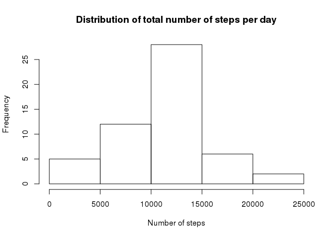
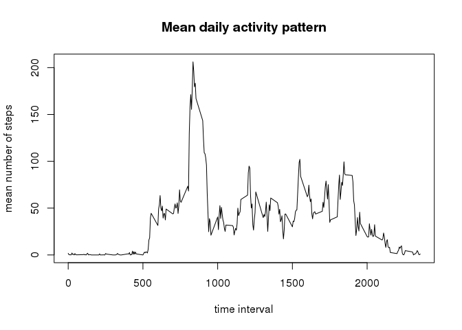
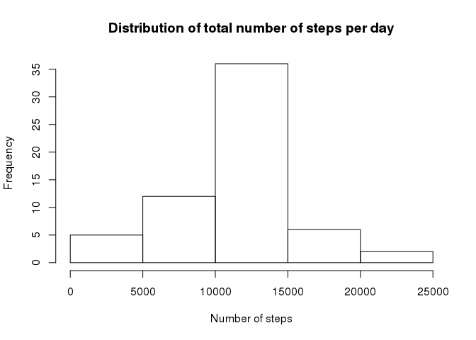
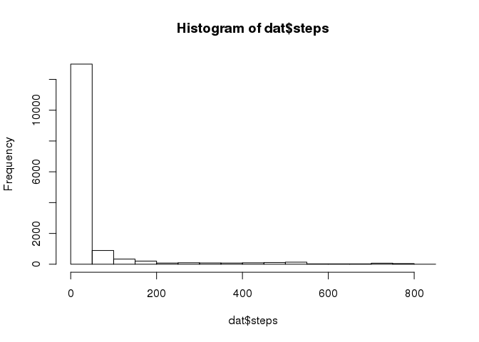
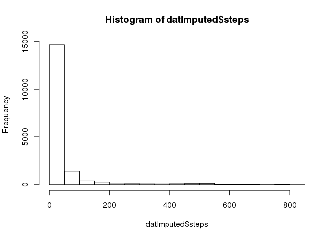
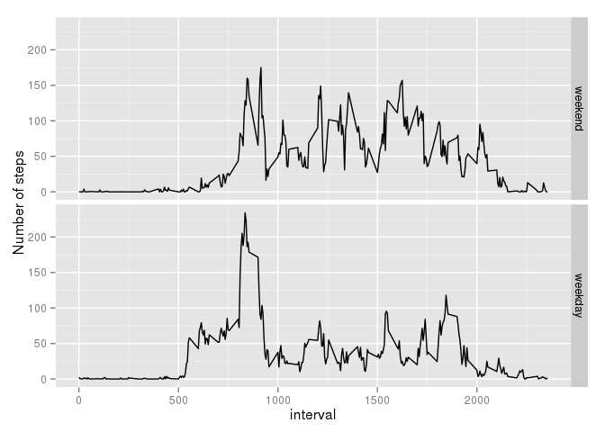

# Reproducible Research: Peer Assessment 1
L Uusitalo  
07/10/2015  


## Loading and preprocessing the data

Read in the data and take a quick look at it:

(I have not been able to make automatic download from https addresses work on my Linux computer so far; however, the http server seems to give the same data file.)


```r
temp <- tempfile()
download.file("http://d396qusza40orc.cloudfront.net/repdata%2Fdata%2Factivity.zip", temp)
dat <- read.csv(unz(temp, "activity.csv"), colClasses = c("numeric", "Date", "numeric"))
unlink(temp)
summary(dat)
```

```
##      steps             date               interval     
##  Min.   :  0.00   Min.   :2012-10-01   Min.   :   0.0  
##  1st Qu.:  0.00   1st Qu.:2012-10-16   1st Qu.: 588.8  
##  Median :  0.00   Median :2012-10-31   Median :1177.5  
##  Mean   : 37.38   Mean   :2012-10-31   Mean   :1177.5  
##  3rd Qu.: 12.00   3rd Qu.:2012-11-15   3rd Qu.:1766.2  
##  Max.   :806.00   Max.   :2012-11-30   Max.   :2355.0  
##  NA's   :2304
```

## What is mean total number of steps taken per day?

We want to make a histogram of the total number of steps taken each day, and calculate the mean and median of the total number of steps taken per day.

To do that, first compute the total numer of steps per each day and save it as a new object  called "dailyTotals". Next, draw the histrogram and calculate mean and median from this data.


```r
dailyTotals <- with(dat, aggregate(steps ~ date, FUN = sum, na.action = na.omit))
hist(dailyTotals$steps, xlab = "Number of steps", main="Distribution of total number of steps per day")
```

 

```r
mean(dailyTotals$steps)
```

```
## [1] 10766.19
```

```r
median(dailyTotals$steps)
```

```
## [1] 10765
```

## What is the average daily activity pattern?

To look at the average daily pattern, take an average of each 5-minute interval across all days. Draw a time series plot of the average daily pattern.


```r
dailyPattern <- with(dat, aggregate(steps ~ interval, FUN = mean, na.action = na.omit))
with(dailyPattern, plot(interval, steps, type="l", xlab = "time interval", ylab="mean number of steps", main="Mean daily activity pattern"))
```

 

Finally, calculate which 5-minute interval, on average across all the days in the dataset, contains the maximum number of steps:


```r
dailyPattern$interval[which(dailyPattern$steps==max(dailyPattern$steps))]
```

```
## [1] 835
```

## Imputing missing values

The number of NA's can be seen from the summary output:


```r
summary(dat)
```

```
##      steps             date               interval     
##  Min.   :  0.00   Min.   :2012-10-01   Min.   :   0.0  
##  1st Qu.:  0.00   1st Qu.:2012-10-16   1st Qu.: 588.8  
##  Median :  0.00   Median :2012-10-31   Median :1177.5  
##  Mean   : 37.38   Mean   :2012-10-31   Mean   :1177.5  
##  3rd Qu.: 12.00   3rd Qu.:2012-11-15   3rd Qu.:1766.2  
##  Max.   :806.00   Max.   :2012-11-30   Max.   :2355.0  
##  NA's   :2304
```

To fill in the missing values, let's use the average for the same time interval from the existing data. This information already exists in the dailyPattern object we created in the previous step.


```r
datImputed<-dat
for (i in 1:nrow(datImputed)) {
        if (is.na(datImputed$steps[i])) {
                datImputed$steps[i] <- dailyPattern$steps[dailyPattern$interval==datImputed$interval[i]]
        }
} 
```

Check to see that there are no missing values any more:


```r
summary(datImputed)
```

```
##      steps             date               interval     
##  Min.   :  0.00   Min.   :2012-10-01   Min.   :   0.0  
##  1st Qu.:  0.00   1st Qu.:2012-10-16   1st Qu.: 588.8  
##  Median :  0.00   Median :2012-10-31   Median :1177.5  
##  Mean   : 37.38   Mean   :2012-10-31   Mean   :1177.5  
##  3rd Qu.: 27.00   3rd Qu.:2012-11-15   3rd Qu.:1766.2  
##  Max.   :806.00   Max.   :2012-11-30   Max.   :2355.0
```

Now, let's make a histogram of the total number of steps taken each day. This is done exactly the same way than earlier, only with the imputed data:


```r
dailyTotalsI <- with(datImputed, aggregate(steps ~ date, FUN = sum, na.action = na.omit))
hist(dailyTotalsI$steps, xlab = "Number of steps", main="Distribution of total number of steps per day")
```

 

Calculate the mean and median total number of steps taken per day:


```r
mean(dailyTotalsI$steps)
```

```
## [1] 10766.19
```

```r
median(dailyTotalsI$steps)
```

```
## [1] 10766.19
```

The data imputation did not markedly change the estimates of the mean and median daily step counts compared to the non-imputed data. 

Note that in the original data, median was an integer numer, as expected. Since we imputed the *mean* value of the interval to replace the missing values, we have imputed also non-integer values, and the median value happens to be such in this imputed data set.

If we look at the distribution pattern of the step counts of the original and imputed data, we can see that the imputation didn't change it makedly:


```r
hist(dat$steps)
```

 

```r
hist(datImputed$steps)
```

 

## Are there differences in activity patterns between weekdays and weekends?

Let's make a factor variable *daytype* which gets one of two possible values, *weekday* or *weekend*:


```r
workdays <- c('Monday', 'Tuesday', 'Wednesday', 'Thursday', 'Friday')
dat$daytype <- factor((weekdays(dat$date) %in% workdays), labels = c('weekend', 'weekday'))
```

Now, let's make separate average activity pattern plots for weekends (Sat, Sun) and weekdays (Mon-Fri):

First, make the average daily pattern data separately for these two types:

```r
dailyPatternW <- with(dat, aggregate(steps ~ interval + daytype, FUN = mean, na.action = na.omit))
```


Then draw the plot:

```r
library(ggplot2)
g<-ggplot(data = dailyPatternW, aes(x=interval, y=steps))
g + geom_line() + facet_grid(daytype ~ .) + ylab("Number of steps")
```

 
